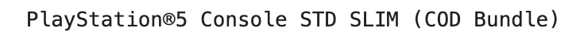
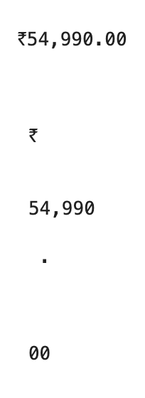
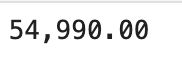
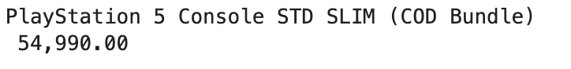

# Amazon Price Tracker for PS5

A Python script to monitor product prices on Amazon and log them for historical tracking.  
It can also send an email notification when a product drops below a target price.

DISCLAIMER: This project has been undertaken for personal and educational purposes only. Scraping Amazon's website may violate their ToC if done for a business use case.

---

## Features
- **Web Scraping**: Uses `BeautifulSoup` to fetch product title and price from Amazon.
- **Data Cleaning**: Extracts and formats price data from HTML.
- **Data Logging**: Saves product name, price, and date to a CSV file.
- **Automated Scheduling**: Checks the price weekly.
- **Email Alerts**: Sends an email when the price hits a desired threshold.

---

## Requirements

Install dependencies with:
```bash
pip install -r requirements.txt

## Example Outputs








